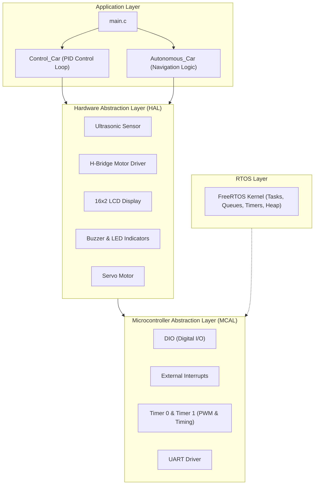

# Closed-Loop Distance Control Vehicle (AVR Embedded Systems & FreeRTOS)

An embedded real-time control system implemented on an AVR microcontroller (ATmega32) designed to maintain a fixed distance from dynamic obstacles using closed-loop PID control and ultrasonic distance sensing. The firmware follows a layered embedded software architecture separating the Microcontroller Abstraction Layer (MCAL), Hardware Abstraction Layer (HAL), FreeRTOS real-time operating system kernel, and application control logic.

---

## Table of Contents

- [Features](#features)
- [Control System Architecture](#control-system-architecture)
- [Layered Software Architecture](#layered-software-architecture)
- [Project Structure](#project-structure)
- [Hardware Pinout Configuration](#hardware-pinout-configuration)
- [Building & Flashing](#building--flashing)
- [Project Documentation & Media](#project-documentation--media)
- [Author](#author)

---

## Features

- **Closed-Loop PID Distance Regulation**:
  - Continuous distance error tracking against a configured setpoint of `25 cm`.
  - Tuned discrete PID controller parameters:
    - Proportional Gain ($K_p$): `1.0`
    - Integral Gain ($K_i$): `0.1`
    - Derivative Gain ($K_d$): `0.7`
  - Dynamic velocity mapping translating PID control output ($u$) into motor PWM duty cycles.
  - Bidirectional motion control: Automated forward propulsion when distance $> setpoint$ and reverse correction when distance $< setpoint$.
- **Layered Embedded Firmware Architecture**:
  - Strict separation of hardware drivers and application logic across MCAL, HAL, and Application layers.
- **Hardware Integration**:
  - **Ultrasonic Sensor (HC-SR04)**: Microsecond-precision echo pulse timing using AVR hardware timers.
  - **H-Bridge DC Motor Driver**: Directional control and PWM-based speed modulation.
  - **Visual & Audio Feedback**: Diagnostic LEDs, alert buzzer, and 16x2 alphanumeric LCD display.
  - **Real-Time Telemetry**: Live distance streaming over UART for hardware debugging and state logging.
- **Real-Time Operating System**:
  - FreeRTOS kernel port for AVR supporting preemptive multitasking, priority-based task scheduling, and inter-task synchronization.

---

## Control System Architecture

```mermaid
flowchart LR
    SP["Setpoint (25 cm)"] --> Sum(("∑"))
    Sensor["HC-SR04 Ultrasonic Sensor"] -->|Feedback Distance| Sum
    Sum -->|Error e(t)| PID["PID Controller (Kp=1.0, Ki=0.1, Kd=0.7)"]
    PID -->|Control Signal u(t)| Map["Velocity Mapping Function"]
    Map --> Driver["L298 H-Bridge Driver"]
    Driver --> Motors["DC Motors (Vehicle Plant)"]
    Motors --> Sensor
    
    subgraph Telemetry ["Debug & Telemetry"]
        UART["UART Serial Interface"]
        LCD["16x2 LCD Display"]
    end
    Sensor --> UART
    Sensor --> LCD
```

---

## Layered Software Architecture



---

## Project Structure

```text
Distance-Control-vehicle/
├── Application/
│   ├── main.c                   # Entry point and supervisor execution loop
│   ├── Control_Car/             # PID control algorithm and closed-loop regulation
│   └── Autonomous_Car/          # Autonomous obstacle avoidance navigation routines
├── HAL/                         # Hardware Abstraction Layer
│   ├── Buzzer/                  # Buzzer driver (PortA Pin3)
│   ├── H_Bridge/                # L298 motor driver controls (PWM / Direction)
│   ├── LCD/                     # Alphanumeric LCD display driver
│   └── LED/                     # Status indication LEDs (PortA Pin0, Pin1)
├── MCAL/                        # Microcontroller Abstraction Layer
│   ├── DIO/                     # Digital I/O pin and port manipulation
│   ├── Interrupt/               # External interrupt handlers
│   ├── Timer 0/                 # 8-bit timer configuration
│   ├── Timer 1/                 # 16-bit timer for input capture & ultrasonic timing
│   └── UART/                    # Serial UART communication driver
├── FreeRtos/                    # FreeRTOS real-time kernel source files and AVR port
├── Digital Control Project.pdf  # Comprehensive academic project documentation & analysis
└── README.md
```

---

## Hardware Pinout Configuration

Verified from embedded driver definitions:

| Peripheral | Port / Pin | Function |
|---|---|---|
| Buzzer | `Port A, Pin 3` | Audible distance alarm |
| Status LED 1 | `Port A, Pin 0` | Status indicator |
| Status LED 2 | `Port A, Pin 1` | Status indicator |
| Ultrasonic Sensor Trigger/Echo | Timer 1 / DIO | Distance measurement pulse |
| H-Bridge Motor Inputs | Timer PWM & DIO | Motor direction & speed modulation |
| UART TX / RX | `Port D, Pin 1 / 0` | Serial debug telemetry output |

---

## Building & Flashing

### Requirements

- **Toolchain**: AVR-GCC compiler (`avr-gcc`, `avr-libc`)
- **IDE**: Eclipse IDE for C/C++ Developers with AVR Plugin, or Microchip Studio
- **Programmer**: USBasp, AVR ISP, or Arduino as ISP
- **Target MCU**: ATmega32 / ATmega16 running at 8 MHz / 16 MHz

### Compilation

```bash
# Build the project using avr-gcc
avr-gcc -Wall -Os -mmcu=atmega32 -DF_CPU=8000000UL \
  -I./Application -I./HAL -I./MCAL -I./FreeRtos -I./Commons \
  Application/main.c Application/Control_Car/Control_Car.c \
  HAL/*/*.c MCAL/*/*.c -o main.elf

# Generate HEX file for flashing
avr-objcopy -O ihex -R .eeprom main.elf main.hex

# Flash to target microcontroller via avrdude
avrdude -c usbasp -p m32 -U flash:w:main.hex:i
```

---

## Project Documentation & Media

- **Technical Report**: Detailed mathematical analysis and control design documentation is available in [Digital Control Project.pdf](file:///e:/Ghanem-GitHub-Portfolio/Distance-Control-vehicle/Digital%20Control%20Project.pdf).
- **Physical Prototypes & Demonstration**:
  - Prototype Assembly 1:
    
  - Sensor & Wiring Setup:
    
  - Completed Vehicle:
    
  - Video Demonstration: [WhatsApp Video Demo](https://github.com/Ghanem-MO/Distance-Control-vehicle/blob/bf52bcfaf4a85cc02e7c22361ad48935fb8ba581/WhatsApp%20Video%202024-12-19%20at%2021.53.03_dc99a960.mp4)

---

## Author

- **Mohamed Ghanem** - [Eng-Ghanem](https://github.com/Eng-Ghanem)
